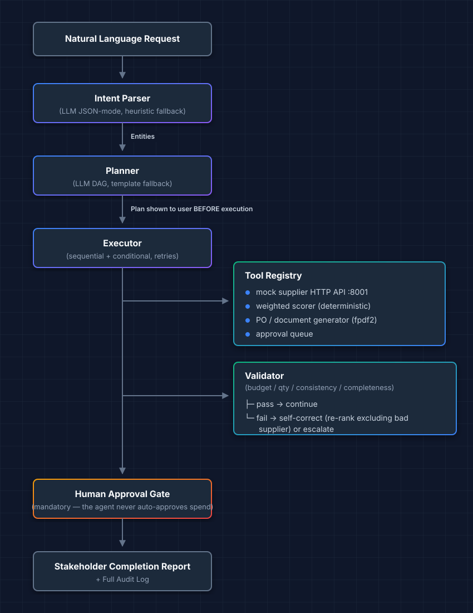

# OrchestrAI — Architecture & Frozen Contracts

HackHorizon 2026 · Problem Statement 2 · Agentic AI for Autonomous Business Workflow Execution

This file is the contract between the three workstreams. Do not change field names without updating parser, planner, executor, tools, and the UI together.

## Pipeline

```
Natural language request
        │
        ▼
  Intent parser (LLM JSON-mode, heuristic fallback)
        │  Entities
        ▼
  Planner (LLM DAG, template fallback)
        │  Plan shown to the user BEFORE execution
        ▼
  Executor (sequential + conditional, retries)
        │
        ├─► Tool registry ──► mock supplier HTTP API :8001
        │                 ──► weighted scorer (deterministic)
        │                 ──► PO / document generator (fpdf2)
        │                 ──► approval queue
        │
        ├─► Validator (budget / qty / consistency / completeness)
        │         ├─ pass  → continue
        │         └─ fail  → self-correct (re-rank excluding bad supplier) or escalate
        │
        ▼
  Human approval gate (mandatory — the agent never auto-approves spend)
        │
        ▼
  Stakeholder completion report + full audit log
```



**The LLM never does arithmetic.** It parses language, drafts a plan, and writes prose. Budget checks, totals, scoring, and ranking are deterministic Python.

## 1. Entities (parser output)

```json
{
  "intent": "procurement",
  "item": "laptops",
  "quantity": 50,
  "budget": 10000000,
  "currency": "PKR",
  "suppliers_to_compare": 3,
  "approval_target": "procurement_manager",
  "constraints": ["total_cost <= budget"],
  "raw_request": "Create a purchase request for 50 laptops under PKR 10 million...",
  "extra": {}
}
```

| Field | Type | Notes |
|---|---|---|
| `intent` | `"procurement"` \| `"vendor_comparison"` \| `"other"` | Selects template plan if LLM is down |
| `item` | string | Catalog key: `laptops` or `software_subscription` |
| `quantity` | int | Units / seats |
| `budget` | number | Ceiling in `currency` |
| `currency` | string | `PKR` or `USD` |
| `suppliers_to_compare` | int | Default 3 |
| `approval_target` | string | Human role, never the agent |
| `constraints` | string[] | Human-readable, also enforced in code |
| `raw_request` | string | Original prompt |
| `extra` | object | Catch-all; ignore unknown keys |

## 2. Plan / DAG

```json
{
  "title": "Laptop procurement — 50 units, PKR 10M ceiling",
  "summary": "Source quotes, rank under budget, generate PO, route for approval.",
  "source": "template",
  "steps": [
    {
      "id": "s1",
      "name": "Fetch supplier quotes",
      "tool": "fetch_suppliers",
      "description": "Query the vendor API for at least 3 quotes.",
      "inputs": {
        "item": "$entities.item",
        "quantity": "$entities.quantity",
        "currency": "$entities.currency",
        "limit": "$entities.suppliers_to_compare"
      },
      "depends_on": [],
      "condition": {"type": "always"},
      "on_fail": "retry",
      "max_retries": 2
    }
  ]
}
```

Input references:

- `$entities.<field>` — from parsed entities
- `$<stepId>.output` — full tool `data` from a prior step
- `$<stepId>.output.<path>` — dotted path into that data

Condition types:

- `always`
- `deps_ok` — every `depends_on` step succeeded
- `output_nonempty` — `{ "type": "output_nonempty", "step": "s1" }`
- `field_true` — `{ "type": "field_true", "step": "s3", "field": "passed" }`

`on_fail`: `retry` | `escalate` | `skip`

Canonical step ids for the default template (both use cases):

| id | tool | purpose |
|---|---|---|
| `s1` | `fetch_suppliers` | HTTP quotes |
| `s2` | `rank_suppliers` | Filter + weighted score |
| `s3` | `validate_selection` | Re-check budget / qty / consistency |
| `s4` | `generate_purchase_order` | PDF artifact |
| `s5` | `submit_for_approval` | Human gate |
| `s6` | `compile_report` | Stakeholder summary |

## 3. Tool envelope

Every tool returns this shape. Tools never raise past the registry.

```json
{
  "ok": true,
  "tool": "fetch_suppliers",
  "latency_ms": 142,
  "data": {},
  "error": null,
  "source": "live"
}
```

`source`: `live` (HTTP) | `fallback` (bundled data after HTTP failure) | `local` (pure function)

### `fetch_suppliers` data

```json
{
  "item": "laptops",
  "quantity": 50,
  "currency": "PKR",
  "quotes": [
    {
      "id": "bytehub",
      "name": "ByteHub Supplies",
      "sku": "BH-PRO-15",
      "unit_price": 175000,
      "total": 8750000,
      "currency": "PKR",
      "delivery_days": 10,
      "warranty_months": 36,
      "rating": 4.8,
      "meets_budget": true,
      "notes": ""
    }
  ]
}
```

### `rank_suppliers` data

```json
{
  "weights": {"price": 0.5, "delivery": 0.3, "warranty": 0.2},
  "rejected": [{"id": "megaoffice", "reason": "Total PKR 11,500,000 exceeds budget PKR 10,000,000"}],
  "ranked": [{"id": "bytehub", "scores": {"price": 100, "delivery": 70, "warranty": 100, "weighted": 91.0}}],
  "selected": {"id": "bytehub"},
  "justification": "ByteHub ranked highest on the disclosed 50/30/20 model after MegaOffice was excluded for busting the ceiling."
}
```

### `validate_selection` data

```json
{
  "passed": true,
  "checks": [
    {"name": "budget_compliance", "ok": true, "detail": "8,750,000 <= 10,000,000"},
    {"name": "quantity_correctness", "ok": true, "detail": "50 == 50"},
    {"name": "supplier_consistency", "ok": true, "detail": "selected id present in ranked + quotes"},
    {"name": "required_fields", "ok": true, "detail": "name, unit_price, total, currency"}
  ],
  "errors": [],
  "suggested_exclude_ids": [],
  "action": "continue"
}
```

`action`: `continue` | `retry_rank` | `escalate`

### `generate_purchase_order` data

```json
{
  "po_number": "PO-2026-0001",
  "path": "generated/PO-2026-0001.pdf",
  "url": "/artifacts/PO-2026-0001.pdf",
  "line_items": [{"description": "laptops", "qty": 50, "unit_price": 175000, "total": 8750000}],
  "grand_total": 8750000,
  "supplier_id": "bytehub"
}
```

### `submit_for_approval` data

```json
{
  "approval_id": "appr_abc",
  "status": "pending_approval",
  "approver": "procurement_manager"
}
```

## 4. Trace event

```json
{
  "id": 17,
  "workflow_id": "wf_01J...",
  "ts": "2026-08-27T16:04:11.204Z",
  "type": "tool_result",
  "step_id": "s1",
  "message": "fetch_suppliers returned 4 quotes (142 ms)",
  "payload": {}
}
```

Event `type` values:

`workflow_created` · `entities_extracted` · `plan_created` · `step_started` · `tool_called` · `tool_result` · `step_done` · `step_failed` · `step_retry` · `validation` · `self_correct` · `escalated` · `approval_requested` · `approval_resolved` · `report_ready` · `workflow_completed` · `workflow_failed` · `log`

SSE endpoint: `GET /api/workflows/{id}/events` — each message is one JSON event, `data: {...}\n\n`. Existing events are replayed on connect, then live events follow.

## 5. HTTP API (app, port 8000)

| Method | Path | Purpose |
|---|---|---|
| `GET` | `/` | UI |
| `GET` | `/api/health` | App + mock API + LLM provider status |
| `POST` | `/api/workflows` | `{request, chaos}` → `{id, entities, plan}` then execute in background |
| `GET` | `/api/workflows` | Recent workflows |
| `GET` | `/api/workflows/{id}` | Full snapshot (entities, plan, steps, events, report, artifacts) |
| `GET` | `/api/workflows/{id}/events` | SSE trace |
| `POST` | `/api/workflows/{id}/approval` | `{decision: "approve"\|"reject", note}` |
| `GET` | `/api/approvals` | Pending inbox |
| `GET` | `/api/tools` | Registered tool schemas (modularity proof) |
| `GET` | `/artifacts/{name}` | Generated PDFs |

Chaos object on create:

```json
{
  "force_timeout": false,
  "force_malformed": false,
  "force_over_budget": false,
  "extra_latency_ms": 0
}
```

## 6. Mock supplier API (port 8001)

| Method | Path | Purpose |
|---|---|---|
| `GET` | `/health` | Liveness |
| `GET` | `/quotes?item=&quantity=&limit=&fail=` | Quotes with optional injected failure |
| `GET` | `/catalog` | Available item catalogs |

`fail` values: `timeout` (first call 503/slow, later OK) · `malformed` · `over_budget` (force a quote over ceiling)

Artificial latency is always applied (80–250 ms) so the trace looks like a real integration.

## 7. SQLite tables

- `workflows(id, created_at, status, request, entities_json, plan_json, report, chaos_json)`
- `steps(workflow_id, step_id, name, tool, status, attempt, output_json, error, started_at, finished_at)`
- `tool_calls(id, workflow_id, step_id, tool, inputs_json, outputs_json, ok, latency_ms, ts)`
- `events(id, workflow_id, ts, type, step_id, message, payload_json)`
- `approvals(id, workflow_id, status, approver, note, created_at, resolved_at)`
- `llm_cache(prompt_hash, provider, model, response, ts)`

Statuses: `pending` · `planning` · `running` · `pending_approval` · `approved` · `rejected` · `escalated` · `failed` · `completed`

## 8. LLM policy

Provider chain: **Gemini (free) → Groq (free) → SQLite cache → deterministic templates**.

Prompts are cached by SHA-256 of `(provider, model, prompt)`. If the venue network dies, the last successful parse/plan/report is reused; if the cache is cold, the template parser/planner still completes the reference use cases.

## 9. Demo acceptance (primary use case)

Given: *"Create a purchase request for 50 laptops under PKR 10 million, compare three suppliers, identify the best option, prepare the purchase order, and send it for approval."*

The system must, without further human input until the approval gate:

1. Parse item=laptops, qty=50, budget=PKR 10,000,000, suppliers=3
2. Retrieve ≥3 quotes
3. Flag any quote whose total exceeds PKR 10,000,000
4. Rank remaining on disclosed weights (price 50 / delivery 30 / warranty 20)
5. Select the top-ranked supplier and state why
6. Generate a PO PDF with correct line items and totals
7. Submit to the approval queue with status `pending_approval`
8. Emit a plain-language report
